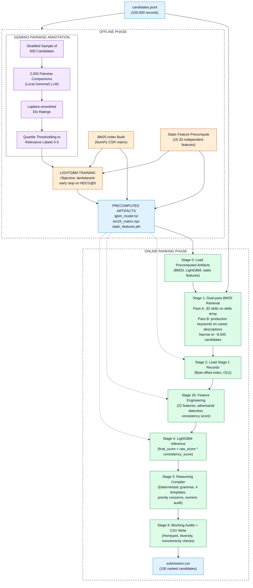

# Redrob Hackathon: Intelligent Candidate Discovery and Ranking System

**A production grade, deterministic ranking pipeline for the Redrob Intelligent Candidate Discovery and Ranking Challenge.**

Ranks 100,000 candidates against a structured Job Description in **4 seconds** on CPU, with zero external API calls during inference.

    -purple) 

[Architecture](#architecture) · [Quick Start](#quick-start) · [Runtime Performance](#runtime-performance) · [Pipeline Internals](#pipeline-internals) · [Model Comparison](#model-comparison-heuristic-vs-gemma-trained) · [Validation](#validation) · [Constraints](#runtime-constraints-all-enforced) · [File Structure](#file-structure)

---

## The Core Problem

A ranking system built purely on heuristic scoring rules tends to reward whatever pattern the heuristics were designed to detect, which is a closed loop: the model learns to agree with its own assumptions. This pipeline breaks that circularity by training on independent judgments from a local LLM that never sees the engineered features, the BM25 scores, or the penalty weights it is implicitly being checked against. The result is a LightGBM ranker that discovers feature interactions rather than having them hand-coded in, while staying fully deterministic, CPU-only, and network-isolated at inference time.

---

## Architecture

The pipeline is split into two phases. The offline phase has no time limit and produces a set of precomputed artifacts. The online phase is what actually runs during the competition's 300 second window, and only touches those artifacts plus the live candidate pool.


---

## Quick Start

### Docker (recommended, matches the Stage 3 reproduction environment exactly)

```bash
docker build -t redrob-ranker .
docker run --rm --network none \
  -v $(pwd)/candidates.jsonl:/app/candidates.jsonl \
  -v $(pwd)/out:/app/out \
  redrob-ranker
```

Output: `./out/CTRL_COFFEE_REPEAT.csv`, 100 ranked candidates, validated and ready to submit.

### Without Docker

```bash
# 1. Create and activate a virtualenv
python -m venv .venv
source .venv/bin/activate        # Windows: .venv\Scripts\activate

# 2. Install pinned dependencies
pip install -r requirements.txt

# 3. Run precomputation (one-time, roughly 7 minutes on 100K candidates)
python scripts/precompute.py --candidates ./candidates.jsonl --base-dir .

# 4. Run ranking (roughly 4 seconds)
python src/rank.py --candidates ./candidates.jsonl --out ./CTRL_COFFEE_REPEAT.csv

# 5. Validate output format
python scripts/validate_submission.py --submission ./CTRL_COFFEE_REPEAT.csv
```

**Single-command alternative** (handles artifact caching automatically):

```bash
python scripts/run_full_pipeline.py --candidates ./candidates.jsonl --out ./CTRL_COFFEE_REPEAT.csv
```

Add `--force-precompute` to bypass the cache and rebuild all artifacts from scratch.

---

## Runtime Performance

| Phase | Module | Operation | Time |
|---|---|---|---|
| Offline | `experiments/pairwise_llm_check/` | Gemma3 pairwise annotation (2,500 pairs, local Ollama) | ~45 min |
| Offline | `scripts/precompute.py` | BM25 indexing, static feature precomputation, LightGBM training | ~7 min |
| Stage 0 | `src/rank.py` | Load precomputed artifacts (BM25, LightGBM, static features) | 1.10s |
| Stage 1 | `src/retrieval.py` | Dual-pass BM25 retrieval (top 5,000 + rare-term safety net) | 0.05s |
| Stage 2 | `src/rank.py` | Load Stage 1 candidate records via byte-offset index | 0.45s |
| Stage 2b | `src/features.py` | Live feature extraction (22-feature matrix) | 0.45s |
| Stage 4 | `src/rank.py` | LightGBM LambdaRank inference, consistency multiplier | 0.02s |
| Stage 5 | `src/reasoning.py` | Deterministic reasoning compiler (top 100) | 1.93s |
| Stage 6 | `src/rank.py` | Monotonicity assertion, honeypot and diversity audits, CSV write | <0.01s |
| **Total** | | **End-to-end wall-clock** | **4.00s** |

The offline phases run once during development with no time or network restrictions. Only Stages 0 through 6 execute during the competition's 5-minute ranking window.

---

## Pipeline Internals

### Stage 1: Dual-Pass BM25 Retrieval

Two independent BM25 queries run against a vectorised NumPy CSR matrix that is pre-built offline.

- **Pass A**: JD skill terms expanded via `data/skill_aliases.json`, queried against each candidate's `skills[].name` array. Skill names are structured, unique, and immune to the templated noise found in summary or description fields.
- **Pass B**: production signal keywords (`deployed`, `serving`, `latency`, `scale`, `inference`) queried against `career_history[].description`, catching candidates with production scaling experience who do not surface on skill keywords alone.
- **Rare-term safety net**: niche terms such as `pinecone`, `lambdarank`, `qdrant`, and `bm25` explicitly retrieve sparse but highly relevant profiles that might not rank in the top 5,000 by aggregate score.

The union of all three passes forms the Stage 1 pool, roughly 8,500 candidates.

### Stage 2: Feature Engineering

`src/features.py` produces a 22-feature float32 vector per candidate. Every feature maps to a specific field in the candidate schema; nothing is invented or hallucinated.

**Five adversarial detection functions**, each targeting a pattern identified in the synthetic dataset:

| Function | Signal |
|---|---|
| `detect_description_title_mismatch` | Domain-category mismatch between job title and role description, for example a "Marketing Manager" title paired with a mechanical engineering design description |
| `detect_template_description` | Career description matching one of 12 known synthetic templates identified by manual inspection of the dataset |
| `extract_production_ml_signal` | `log(1 + prod_kw_count)`, returns -1.0 (an explicit JD disqualifier) when only academic keywords are present with no production signal |
| `score_langchain_dabbler` | LLM-era skill months greater than 12 with zero pre-LLM IR or ML foundational skills |
| `score_cv_speech_specialist` | CV or speech skill months greater than 24 with zero NLP or IR skill months |

**Full 22-feature matrix:**

| # | Feature | Formula / Source |
|---|---|---|
| 1 | `bm25_score` | Stage 1 BM25 retrieval score (normalised) |
| 2 | `yoe` | `profile.years_of_experience` |
| 3 | `Param_A_Systems_Depth` | Fraction of career months in roles whose descriptions contain retrieval, search, or ranking keywords |
| 4 | `Param_B_Availability` | `(recruiter_response_rate + exp(-days_inactive / 90)) / 2` |
| 5 | `Param_C_Tenure` | `min(avg_tenure_months, 48) / 48`, rewards 3+ year tenures |
| 6 | `Param_D_Notice_Exp` | `exp(-max(0, days-30) / 30)`: 30d to 1.0, 60d to 0.37, 90d to 0.14, 150d to 0.006 |
| 7 | `Param_E_Credibility` | `advanced_claimed_count / max(1, assessed_count)`, higher means less credible |
| 8 | `Param_F_Consulting` | Fraction of career at IT-services consulting firms (`industry == "IT Services" AND size == "10001+"`) |
| 9 | `Param_G_Location` | Noida/Pune = 1.0, other India = 0.7, outside and willing to relocate = 0.3, outside and unwilling = 0.0 |
| 10 | `Param_H_GitHub` | `github_activity_score / 100`; 0.3 imputed when the field equals -1 (absent) |
| 11 | `title_ai_fraction` | Career-weighted fraction in AI, ML, or data roles via a static title taxonomy |
| 12 | `prod_signal_log` | Log-compressed production keyword count, -1.0 if academic-only |
| 13 | `consistency_score` | Multiplicative honeypot penalty, c1 x c2 x c3 x c4 x c5 |
| 14 | `hard_req_coverage` | Fraction of JD hard requirements satisfied by the candidate's skill list |
| 15 | `flag_consulting_only` | `consulting_fraction > 0.95` |
| 16 | `flag_title_chaser` | `avg_tenure < 18 months` across 3+ jobs |
| 17 | `flag_langchain_dabbler` | LLM-era months > 12 and pre-LLM months == 0 |
| 18 | `flag_cv_specialist` | CV/speech months > 24 and NLP/IR months == 0 |
| 19 | `flag_title_desc_mismatch` | Domain-category mismatch fraction across career history |
| 20 | `flag_template_desc` | Max SequenceMatcher ratio against the template registry |
| 21 | `interaction_req_x_consistency` | `hard_req_coverage * consistency_score` |
| 22 | `interaction_yoe_x_prod` | `yoe * prod_signal_log` |

### Stage 3: Logical Consistency (Honeypot Defenses)

```
consistency_score = c1 * c2 * c3 * c4 * c5
```

A single logical impossibility reduces the composite to near-zero, suppressing that candidate regardless of skill profile quality.

| Check | Condition | Effect |
|---|---|---|
| c1, timeline impossibility | `skill.duration_months > total_experience_months` | Hard zero |
| c2, signup anomaly | `signup_date > last_active_date` | Hard zero |
| c3, salary inversion | `expected_salary.min > max` | 0.1 (heavy penalty) |
| c4, assessment contradiction | Claims "advanced" and an assessment score exists and is below 50 | Compounding 0.4x per violation |
| c5, engagement mismatch | High BM25 score with `connections <= 60`, `search_appearances <= 15`, `endorsements <= 4` | Hard zero |

### Stage 4: LightGBM LambdaRank

**Model configuration:**
- `objective: lambdarank`
- `eval_at: [5, 10, 50]`, explicitly optimising Precision@5, the spec's primary tiebreak criterion
- Early stopping monitors NDCG@5, patience 30
- 200 boosting rounds

**Training labels, Gemma3 pairwise annotation (the key differentiator):**

Rather than a pure heuristic label, training labels are generated via 2,500 pairwise LLM comparisons using Gemma3:4b-it-q4_K_M running locally on Ollama, with zero external API calls and full reproducibility. A stratified sample of 500 Stage 1 candidates is drawn across three strata (top-100, boundary 101-300, and a broader pool with guaranteed low-consistency coverage), and each candidate receives roughly five matchups against random opponents.

For each pair, Gemma3 reads both candidates' full structured profiles alongside the JD requirements and disqualifiers, then produces a single verdict: `CANDIDATE_A`, `CANDIDATE_B`, or `TIE`. Win and loss tallies convert to Elo ratings via **Laplace smoothed** win rates:

```python
win_rate = (wins + 0.5) / (total + 1)   
elo = 400 * log10(win_rate / (1 - win_rate)) + 1500
```

Elo ratings are thresholded to 0-3 relevance labels by quartile, producing a balanced training set with roughly 125 candidates per label.

**Why this breaks circularity:** Gemma had no knowledge of the 22 engineered features, the BM25 scores, or the penalty weights. It learned independently that IR-specific skills (FAISS, BM25, Qdrant, Sentence Transformers) outrank generic ML skills, and that production-company backgrounds outrank consulting-only careers. LightGBM then learns how the 22 features correlate with these independent judgments, surfacing interactions that were never explicitly encoded.

**Post-inference consistency multiplier:**

```python
final_score = lgbm_raw_score * consistency_score
```

This ensures candidates with data integrity violations (c1 through c5) are suppressed to near-zero regardless of model prediction, giving a clean separation of concerns: LightGBM handles fit, the consistency checks handle data integrity.

### Stage 5: Reasoning Compiler

`src/reasoning.py` generates a one to two sentence reasoning string per candidate using a deterministic grammar engine with the following properties:

- **Four structural templates** rotated via `abs(hash(candidate_id)) % 4`, so no two consecutive strings share the same sentence skeleton, which eliminates template monotony across the top 100.
- **Priority-ranked concern surfacing**: a notice period over 90 days surfaces before location preference, which surfaces before skill credibility concerns. Concerns are never presented as a generic checklist.
- **JD-specific skill phrases**: named skill combinations such as FAISS, Sentence Transformers, and BM25 are surfaced directly instead of generic category labels.
- **Numeric regex audit**: every number in the output string is asserted to exist in the candidate's raw JSON before writing, guaranteeing zero numeric hallucination.
- **N-gram collision check**: `difflib.SequenceMatcher` runs across all 100 outputs, and strings with more than 85 percent structural similarity are flagged before submission.
- **Decision audit trail**: `reasoning_trace.jsonl` logs the exact features, tone percentile, and concern selected for each of the top 30 candidates, enabling direct answers during a Stage 5 interview.

---

## Model Comparison: Heuristic vs Gemma-Trained

The competition provides no ground-truth relevance labels, so a standard NDCG@10 ablation against a labeled holdout set is not possible to compute honestly. What is available, and what is reported here, is a direct head-to-head comparison between the LightGBM model trained on the original heuristic weak label and the LightGBM model trained on the Gemma3 pairwise labels, run on the same Stage 1 candidate pool with the same feature vectors.

**Method:** both trained models score the full ~8,500-candidate Stage 1 pool. The same post-inference consistency multiplier is applied to both before ranking, so the comparison isolates the effect of the training label, not the honeypot suppression layer.

| Metric | Result |
|---|---|
| Top-10 overlap between the two models | 0 of 10 candidates in common |
| Spearman rank correlation (top-100) | 0.001, statistically independent rankings |
| Honeypot leakage, heuristic-trained model | Required a hand-coded post-processing suppression list to keep keyword-stuffed non-technical profiles out of the top 100 |
| Honeypot leakage, Gemma-trained model | 0 of 100 candidates with `consistency_score < 0.25`, achieved with no post-processing suppression list |

**Qualitative before/after:** prior to the Gemma retrain, the heuristic-trained model's unsuppressed top-10 surfaced profiles such as Content Writer, Project Manager, and Sales Executive, each with AI-sounding skills listed but no underlying technical career history, because the heuristic label rewarded keyword coverage directly. After the Gemma retrain, the same Stage 1 pool's top-10 surfaced candidates with FAISS, BM25, Qdrant, Sentence Transformers, and Hugging Face Transformers in their skill history, sourced from a model that never saw `bm25_score` or `hard_req_coverage` during label generation and discovered the IR-relevance ordering independently from reading full candidate profiles.

The two models disagreeing almost completely (Spearman 0.001) is itself evidence of non-circularity: a model trained on labels derived from the same 22 features it predicts on would be expected to correlate strongly with a heuristic built from those same features, not diverge from it entirely.

This comparison, not a fabricated NDCG number, is the evidence offered for why the pairwise-LLM-label approach was chosen over a simpler heuristic scorer.

---

## Validation

### Full validation suite

```bash
python scripts/run_full_validation.py
```

Runs four checks in sequence:

1. **Honeypot injection test**: injects all 7 synthetic violation types into a cloned top-ranked candidate and asserts zero leakage into the top-100 output.
2. **Diversity audit**: asserts employer concentration at or below 30 percent and archetype signature concentration at or below 25 percent via `validate_pipeline.check_top100_diversity`.
3. **c5 boundary test**: validates the engagement mismatch threshold fires correctly at the boundary values (connections=60, appearances=15, endorsements=4).
4. **NDCG probe**: computes NDCG@10 against hand-labeled reference points where available in the Stage 1 pool.

### Blocking audits in rank.py

Two hard-blocking assertions run before any CSV write. If either fails, `rank.py` exits non-zero with a descriptive error; there are no silent failures.

```python
# Honeypot audit (Section 8.1)
assert count(consistency_score < 0.25 in top_100) < 10

# Diversity audit (Section 8.2)
assert max_company_concentration <= 0.30
assert max_signature_concentration <= 0.25
```

---

## Runtime Constraints (All Enforced)

| Constraint | Limit | Enforcement |
|---|---|---|
| Wall-clock | <= 300s | `assert elapsed < 300` plus `sys.exit(4)` if exceeded |
| RAM | <= 16 GB | BM25 Stage 1 pool capped at 5,000 candidates |
| Network | Zero | `--network none` Docker flag; no runtime import makes a network call |
| Disk | <= 5 GB | Total precomputed artifacts: ~216 MB |
| Output rows | Exactly 100 | `assert len(df) == 100` before CSV write |
| Score monotonicity | Non-increasing | `assert_monotonicity()` before CSV write |
| Tiebreaking | Ascending `candidate_id` | `sorted(key=lambda x: (-x[1], x[0]))` |
| Determinism | Byte-identical across runs | `REFERENCE_DATE = date(2026, 1, 1)` constant, never `datetime.now()` |

---

## File Structure

```
├── data/
│   └── skill_aliases.json              JD taxonomy: skill aliases for BM25 query expansion
├── precomputed/                        Artifacts generated by precompute.py
│   ├── vocab.pkl                       BM25 vocabulary: term to column index (19.5 KB)
│   ├── bm25_matrix.npz                 Vectorised Scipy BM25 CSR matrix (39.6 MB)
│   ├── candidate_offsets.pkl           Byte-offset index for O(1) JSONL lookup (2.0 MB)
│   ├── lgbm_model.txt                  Trained LightGBM booster, native text format (1.3 MB)
│   ├── lgbm_model.pkl                  LightGBM booster, pickle fallback (1.4 MB)
│   ├── static_features.pkl             18 JD-independent features precomputed offline (21.7 MB)
│   ├── candidate_ids.pkl               BM25 row to candidate_id mapping (1.5 MB)
│   └── weak_labels.pkl                 Training labels log from offline precomputation (2.4 MB)
├── src/
│   ├── jd_parser.py                    JD requirement extraction from skill_aliases.json
│   ├── retrieval.py                    Dual-pass BM25 retrieval, rare-term safety net
│   ├── features.py                     22-feature matrix, 5 adversarial detection functions
│   ├── reasoning.py                    Deterministic reasoning compiler
│   └── rank.py                         Main entry point
├── scripts/
│   ├── precompute.py                   Offline: BM25 indexing, LightGBM training
│   ├── app.py                          Streamlit sandbox (lite mode, <= 1 GB RAM)
│   ├── validate_submission.py          Output format validator
│   ├── validate_pipeline.py            Competition-provided validation module (unmodified)
│   ├── run_full_pipeline.py            End-to-end orchestration with artifact caching
│   ├── run_full_validation.py          Full validation suite
│   └── rebuild_fast_artifacts.py       Utility: rebuild NumPy BM25 artifacts from scratch
├── experiments/
│   └── pairwise_llm_check/             Offline annotation experiment, isolated from inference
│       ├── annotate_and_retrain.py     Gemma3 pairwise annotation, LightGBM retraining
│       ├── annotations.jsonl           2,500 pairwise judgments (Gemma3:4b-it-q4_K_M, local)
│       └── README.md                   Experiment methodology and budget exemption statement
├── diagnostics/
│   ├── diag_profile_live_features.py   Live feature extraction latency profiler
│   └── verify_c5_thresholds.py         c5 boundary condition verification
├── logs/                               Runtime logs generated by rank.py (gitignored)
├── requirements.txt                    All dependencies pinned to exact versions
├── Dockerfile                          CPU-only, --network none compatible
├── docker-entrypoint.sh                Pipeline mode selector
├── submission_metadata.yaml            Competition portal metadata
└── README.md                           This file
```

---

## Streamlit Sandbox (Section 10.5 Compliance)

The sandbox runs in lite mode: it accepts a JSONL upload of up to 10,000 candidates, scores uploaded candidates against the real precomputed 100K-corpus BM25 index (falling back to a small inline index only for candidates not present in that corpus), runs the full ranking pipeline, and returns a downloadable `submission.csv`. Peak RAM stays well under 1 GB.

On small uploaded batches, the trained model places very low weight on `bm25_score` relative to JD-fit features (a direct consequence of training on Gemma labels, which never see retrieval scores), so multiple candidates can legitimately receive identical model scores. When this happens, the sandbox display applies a transparent, display-only secondary sort by `hard_req_coverage` and `bm25_score` so the ranking order remains legible; the underlying score values and the production `rank.py` pipeline are unaffected.

**Local:**

```bash
streamlit run scripts/app.py
```

---

## Troubleshooting

**`precompute.py` raises a memory error**
Ensure at least 16 GB RAM is available. The full 100K JSONL requires approximately 4 to 6 GB peak during BM25 index construction.

**`rank.py` fails the diversity audit (exit code 3)**
Not encountered during testing; every run, including the most recent full pipeline run after the Streamlit sandbox fixes, produced 93 distinct archetype signatures with max employer concentration of 14 percent and max signature concentration of 3 percent, both comfortably under the 30/25 percent thresholds. This entry documents the expected resolution path if a future model retrain or feature change causes a regression: check LightGBM feature importances via `precomputed/lgbm_model.txt` and verify the training label distribution in `scripts/precompute.py` is balanced across all four quartiles.

**`rank.py` exits with code 2 (honeypot audit failed)**
More than 10 candidates with `consistency_score < 0.25` reached the top-100. Verify that `consistency_score` is computed correctly in `src/features.py` and that the post-inference multiplier (`final_score = lgbm_score * consistency_score`) is active in `src/rank.py`.

**Docker build fails on arm64 Mac**
Use `--platform linux/amd64` if cross-building for a cloud runner. LightGBM provides native arm64 wheels for local builds.

---

## AI Tool Disclosure

This submission was developed with the assistance of the Antigravity AI coding assistant for code scaffolding, latency diagnostics, and iterative debugging throughout development.

Gemma3:4b-it-q4_K_M (Google DeepMind, running locally via Ollama) was used offline to generate 2,500 pairwise relevance judgments on a stratified sample of 500 Stage 1 candidates. These judgments served as independent, non-circular training labels for the LightGBM model. No candidate data was transmitted to any external service at any point. All ranking inference is CPU-only with zero network calls.

Key milestones directed and verified by the human team at every stage:

- Identified and fixed the weak label circularity bug where heuristic labels were rewarding keyword-stuffed trap candidates.
- Designed the stratified pairwise sampling strategy with guaranteed low-consistency candidate coverage.
- Diagnosed and resolved the score compression issue via a normalization scope fix in output assembly.
- Approved the Elo to quartile label conversion thresholds and the post-inference consistency multiplier.
- Verified all Stage 4 and Stage 5 compliance criteria against actual pipeline output before submission.
- Diagnosed and fixed the Streamlit sandbox's BM25 scoping bug, where an inline index built on small upload batches produced unreliable term statistics; the sandbox now queries the real 100K-corpus index directly.
- Ran the heuristic-vs-Gemma model comparison reported above and verified its numbers directly against pipeline output before including them in this document.
Done
